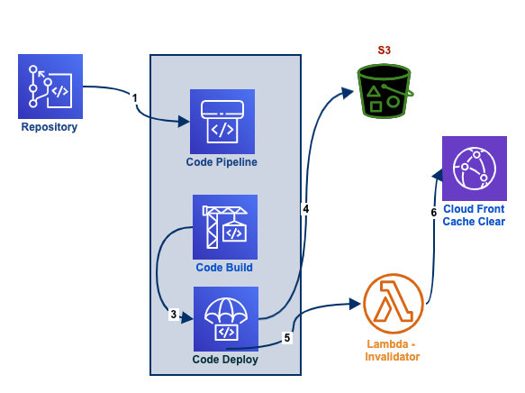
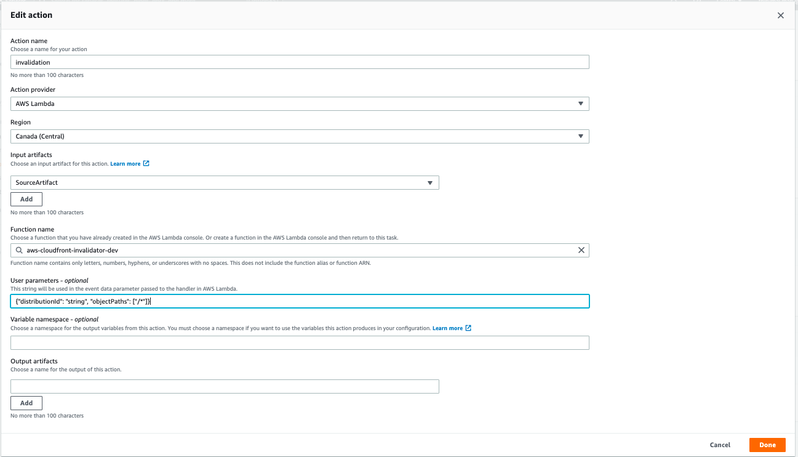

# AWS cloud front invalidator

CloudFront Invalidation in CodePipeline using Lambda 

#### Framework

    pip install chalice

#### Deploy

1. Make sure `~ .aws/credentials`, file contains `IAM` user with permission of `lambda, IAM role`

Run `chalice deploy` to deploy your Chalice application:

    chalice deploy

#### User parameters 

Replace `{distribution_id}` 

    {
       "distributionId": "{distribution_id}", 
       "objectPaths": ["/*"]
    }

